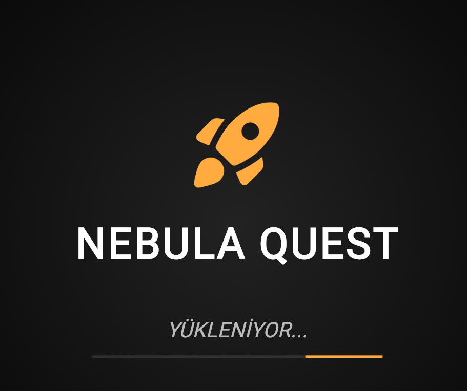
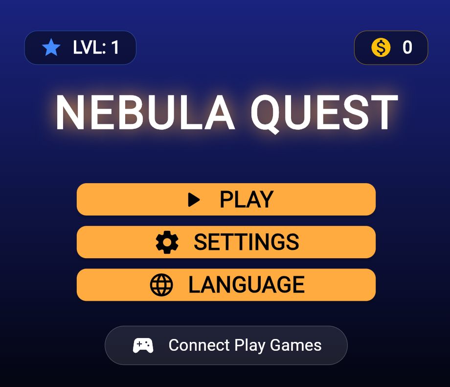
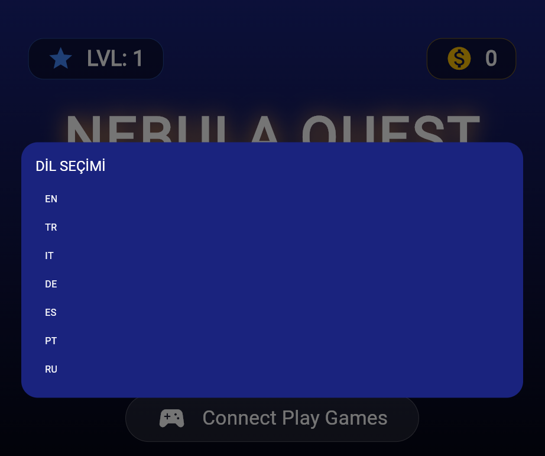

Bu proje, Flutter ile geliştirilecek mobil oyunlar için modüler, ölçeklenebilir ve performans odaklı bir temel (boilerplate) yapısıdır. Projenin amacı, bir oyunun ihtiyaç duyduğu temel altyapıları (dil desteği, veri yönetimi, responsive tasarım) en baştan hazır sunmaktır.

## 📸 Ekran Görüntüleri

Aşağıda uygulamanın mevcut arayüz gelişimini görebilirsiniz:

| Yükleme Ekranı | Ana Menü | Dil Seçimi |
| :---: | :---: | :---: |
|  |  |  |

## Öne Çıkan Özellikler

* **Dinamik Dil Motoru (Localization):** JSON tabanlı sistem. Uygulama içinden anlık dil değişimi yapılabilir. (Desteklenenler: TR, EN, IT, DE, ES, PT, RU).
* **Kalıcı Veri Yönetimi (DataManager):** `shared_preferences` entegrasyonu ile altın, seviye ve kullanıcı ayarları cihaz hafızasında güvenle saklanır.
* **Responsive Tasarım:** `flutter_screenutil` paketi ile tüm telefon ve tablet boyutlarına tam uyumlu, pixel-perfect arayüz.
* **Google Play Games Altyapısı:** İleride eklenecek "Bulut Kayıt" (Cloud Save) ve "Başarımlar" (Achievements) için hazır mimari.
* **Şık Görsel Tasarım:** Özel gradyan geçişleri ve oyun atmosferine uygun UI elementleri.

##  Proje Yapısı

- `lib/data_manager.dart`: Yerel veri saklama ve yönetim merkezi.
- `lib/localization_service.dart`: Çoklu dil desteği ve JSON yükleme mantığı.
- `lib/loading_screen.dart`: Uygulama açılış ve varlık yükleme simülasyonu.
- `lib/home_menu.dart`: Ana kontrol merkezi ve kullanıcı arayüzü.

## 🚀 Başlangıç

1. Bu depoyu klonlayın.
2. `flutter pub get` komutu ile paketleri indirin.
3. `flutter run` ile projeyi başlatın.

---
*Geliştirme aşamasındadır. Yakında: Oyun içi mekanikler ve Google Play Games entegrasyonu!*
